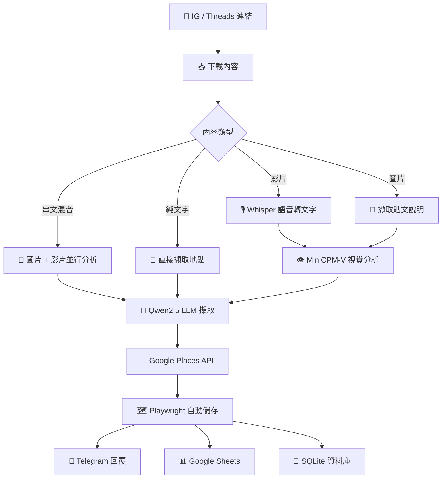

# Instagram Place to Maps

[](https://www.python.org/downloads/)
[](https://opensource.org/licenses/MIT)
[](https://core.telegram.org/bots)

將 Instagram / Threads 美食 Reels、貼文、串文中的餐廳/景點資訊自動擷取，同步至 Google Sheets 並儲存至 Google Maps 清單，打造個人美食地圖。


## 功能特色

| 功能 | 說明 |
|------|------|
| 🎬 **多格式支援** | Instagram Reels、貼文、IGTV、分享連結；Threads 貼文、串文（thread chain） |
| 🎙️ **語音轉文字** | 使用 Faster Whisper 本地轉錄 |
| 👁️ **視覺分析** | MiniCPM-V 辨識招牌、菜單、環境 |
| 🧠 **智慧擷取** | Qwen2.5 LLM 結構化地點資訊 |
| 📍 **地點驗證** | Google Places API 取得地址、評分、評論數 |
| 📊 **雲端同步** | 自動寫入 Google Sheets，可連動 My Maps |
| 🗺️ **自動儲存** | Playwright 自動化將地點加入 Google Maps 清單 |
| 💾 **本地儲存** | SQLite 資料庫保存完整記錄 |
| 🤖 **Telegram Bot** | Webhook 模式即時互動 |

## 運作流程



<details>
<summary>ASCII 流程圖</summary>

```
┌─────────────┐
│  IG 連結    │  Reel / 貼文 / IGTV / 分享連結
└──────┬──────┘
       ▼
┌─────────────┐
│  下載內容   │  yt-dlp（影片）/ instaloader（圖片）
└──────┬──────┘
       ▼
┌──────┴──────┐
│  分析處理   │
│  ┌────────┐ │
│  │Whisper │ │  語音 → 文字
│  └────────┘ │
│  ┌────────┐ │
│  │MiniCPM │ │  畫面 → 描述
│  └────────┘ │
└──────┬──────┘
       ▼
┌─────────────┐
│ LLM 擷取   │  Qwen2.5 → 結構化地點資訊
└──────┬──────┘
       ▼
┌─────────────┐
│ Places API  │  搜尋驗證 → 地址、評分、座標
└──────┬──────┘
       ▼
┌─────────────┐
│ Playwright  │  自動儲存至 Google Maps 清單
└──────┬──────┘
       ▼
┌──────┴──────┐
│   輸出      │
│  ┌────────┐ │
│  │Telegram│ │  即時回覆 + Maps 連結
│  └────────┘ │
│  ┌────────┐ │
│  │Sheets  │ │  雲端同步
│  └────────┘ │
│  ┌────────┐ │
│  │SQLite  │ │  本地儲存
│  └────────┘ │
└─────────────┘
```

</details>

## 系統需求

### 基本需求

| 類別 | 需求 |
|------|------|
| **Python** | 3.10 或更高版本 |
| **作業系統** | Windows / macOS / Linux |
| **Ollama** | 本地運行 Qwen2.5 + MiniCPM-V |
| **FFmpeg** | Whisper 音訊處理所需 |

### API 與帳號

| 服務 | 用途 | 必要性 |
|------|------|--------|
| Telegram Bot Token | Bot 互動 | ✅ 必要 |
| Google Places API | 地點搜尋驗證 | ⚡ 建議 |
| Google Service Account | Sheets 同步 | 📋 可選 |

## 快速開始

### 1. 複製專案

```powershell
git clone https://github.com/user/instagram-place-to-maps.git
cd instagram-place-to-maps
```

### 2. 建立虛擬環境

```powershell
python -m venv .venv
.\.venv\Scripts\Activate.ps1
pip install -r requirements.txt
playwright install chromium
```

### 3. 設定環境變數

```powershell
Copy-Item .env.example .env
notepad .env
```

### 4. 下載 Ollama 模型

```powershell
ollama pull qwen2.5:7b
ollama pull minicpm-v
```

### 5. 啟動服務

```powershell
.\start.ps1

# 或手動啟動
uvicorn app.main:app --port 8001 --reload
```

### 6.（可選）設定 Webhook

```powershell
# 使用 Cloudflare Tunnel
cloudflared tunnel --url http://localhost:8001
```

## 環境變數

### 必要設定

| 變數 | 說明 | 範例 |
|------|------|------|
| `TELEGRAM_BOT_TOKEN` | 從 @BotFather 取得 | `123456:ABC...` |
| `TELEGRAM_ALLOWED_CHAT_IDS` | 允許的 Chat ID（逗號分隔） | `123456789` |

### 模型設定

| 變數 | 說明 | 預設值 |
|------|------|--------|
| `WHISPER_MODEL_SIZE` | Whisper 模型大小（`tiny`、`base`、`small`、`medium`、`large`） | `base` |
| `WHISPER_DEVICE` | 運算裝置（`cpu` 或 `cuda`） | `cpu` |
| `OLLAMA_HOST` | Ollama 服務位址 | `http://localhost:11434` |
| `OLLAMA_MODEL` | 文字 LLM 模型 | `qwen2.5:7b` |
| `OLLAMA_VISION_MODEL` | 視覺 LLM 模型 | `minicpm-v` |

### 可選設定

| 變數 | 說明 |
|------|------|
| `GOOGLE_PLACES_API_KEY` | Google Places API Key |
| `WEBHOOK_URL` | Telegram Webhook 網址 |
| `GOOGLE_SERVICE_ACCOUNT_FILE` | Service Account JSON 檔案路徑 |
| `GOOGLE_SHEETS_ID` | 目標 Spreadsheet ID |
| `GOOGLE_MAPS_SAVE_ENABLED` | 啟用 Playwright 自動儲存至 Maps 清單（`true`/`false`） |
| `GOOGLE_MAPS_DEFAULT_LIST` | 預設儲存清單名稱（如「想去」） |
| `PLAYWRIGHT_STATE_PATH` | 瀏覽器狀態儲存路徑 |
| `PLAYWRIGHT_DELAY_MIN` | 自動化最小延遲（秒） |
| `PLAYWRIGHT_DELAY_MAX` | 自動化最大延遲（秒） |

## 使用方式

### 基本操作

1. 在 Telegram 找到你的 Bot
2. 傳送 `/start` 開始
3. 貼上 Instagram 或 Threads 連結
4. 等待分析結果（約 1-3 分鐘）
5. 地點將自動儲存至你的 Google Maps 清單

### 支援的連結格式

| 平台 | 類型 | URL 格式 |
|------|------|----------|
| Instagram | Reel | `instagram.com/reel/xxx` |
| Instagram | Reels | `instagram.com/reels/xxx` |
| Instagram | 貼文 | `instagram.com/p/xxx` |
| Instagram | IGTV | `instagram.com/tv/xxx` |
| Instagram | 分享連結 | `instagram.com/share/xxx` |
| Threads | 貼文/串文 | `threads.net/@user/post/xxx` |
| Threads | 貼文/串文 | `threads.com/@user/post/xxx` |
| Threads | 短連結 | `threads.net/t/xxx` |

### Bot 指令

| 指令 | 說明 |
|------|------|
| `/start` | 顯示歡迎訊息 |
| `/help` | 使用說明 |
| `/list` | 查看已儲存的地點 |
| `/setup_google` | 設定 Google 帳戶登入（Playwright 自動儲存用） |
| `/google_lists` | 查看 Google Maps 清單 |
| `/set_list <名稱>` | 設定預設儲存清單 |

## 專案結構

```
instagram-place-to-maps/
├── app/
│   ├── config.py                # 環境變數設定
│   ├── main.py                  # FastAPI + Webhook 進入點
│   ├── bot/
│   │   └── handlers.py          # Telegram Bot 處理器
│   ├── database/
│   │   └── models.py            # SQLAlchemy 資料模型
│   ├── services/
│   │   ├── downloader.py        # 影片/圖片下載
│   │   ├── transcriber.py       # 語音轉文字（Whisper）
│   │   ├── visual_analyzer.py   # 視覺分析（MiniCPM-V）
│   │   ├── place_extractor.py   # LLM 地點擷取（Qwen）
│   │   ├── google_places.py     # Google Places API
│   │   ├── google_sheets.py     # Sheets 同步
│   │   └── google_maps_saver.py # Maps 自動儲存（Playwright）
│   └── prompts/                 # LLM Prompt 模板
├── browser_state/               # Playwright 瀏覽器狀態
├── docs/                        # 文件
├── temp_videos/                 # 暫存下載檔案
├── credentials.json             # Google Service Account
├── cookies.txt                  # Instagram Cookies
├── start.ps1                    # PowerShell 啟動腳本
└── start.bat                    # Windows 啟動腳本
```

## 資料儲存

### SQLite 資料庫

自動建立 `food_places.db`，儲存欄位包括：

- 地點名稱（中/英文）
- 城市、國家、類型
- Google Place ID、Maps 連結
- 評分、評論數
- 原始語音/視覺分析結果
- 來源 Instagram URL

### Google Sheets 同步

設定 Service Account 後自動同步至指定 Spreadsheet，可連動 Google My Maps 顯示地圖。

### Playwright 自動儲存

透過 Playwright 瀏覽器自動化，將地點直接加入你的 Google Maps「想去」清單：

1. **首次設定**：在 Telegram 執行 `/setup_google`，會開啟瀏覽器讓你登入 Google
2. **登入後**：系統自動儲存 cookies 至 `browser_state/google_auth.json`
3. **後續使用**：分析完成後自動以 headless 模式儲存地點
4. **切換清單**：使用 `/set_list 清單名稱` 變更目標清單

> ⚠️ 此功能使用瀏覽器自動化，請適度使用避免觸發 Google 安全機制

## 常見問題

<details>
<summary><strong>影片下載失敗</strong></summary>

- 確認 `cookies.txt` 有效且格式正確
- Instagram 可能需要登入才能存取內容
- 嘗試從瀏覽器重新匯出 cookies

</details>

<details>
<summary><strong>Whisper 轉錄緩慢</strong></summary>

- 使用 `tiny` 或 `base` 模型加速
- 若有 GPU，設定 `WHISPER_DEVICE=cuda`
- 確認 FFmpeg 已正確安裝

</details>

<details>
<summary><strong>Google Places 找不到地點</strong></summary>

- 確認 API Key 已啟用 Places API (New)
- 嘗試更精確的店名或加上城市名稱
- 在 Google Cloud Console 檢查 API 配額

</details>

<details>
<summary><strong>Ollama 連線失敗</strong></summary>

- 確認 Ollama 服務已啟動：`ollama serve`
- 檢查模型已下載：`ollama list`
- 確認 `OLLAMA_HOST` 設定正確

</details>

<details>
<summary><strong>Playwright 自動儲存失敗</strong></summary>

- 執行 `/setup_google` 重新登入
- 檢查 `browser_state/google_auth.json` 是否存在
- 確認 Playwright 已安裝瀏覽器：`playwright install chromium`
- Google 帳戶可能需要重新驗證（定期過期）

</details>

## 開發路線

- [x] 支援 Instagram Reel / 貼文 / IGTV / 分享連結
- [x] 支援 Threads 貼文（圖片、影片、輪播、純文字）
- [x] 支援 Threads 串文（thread chain）— 自動合併同作者的連續貼文
- [x] 語音轉文字 + 視覺分析
- [x] Google Places API 整合
- [x] Google Sheets 同步
- [x] 訊息去重防止重複處理
- [x] Playwright 自動儲存至 Google Maps 清單
- [ ] 批次處理多個連結
- [ ] KML 匯出（Google Earth）
- [ ] 重複地點偵測
- [ ] 依城市/類型分類瀏覽

## 貢獻

歡迎貢獻！請隨時提交 Pull Request。

1. Fork 此專案
2. 建立功能分支（`git checkout -b feature/amazing-feature`）
3. 提交變更（`git commit -m 'Add some amazing feature'`）
4. 推送至分支（`git push origin feature/amazing-feature`）
5. 開啟 Pull Request

## 授權

本專案採用 MIT 授權條款 - 詳見 [LICENSE](LICENSE) 檔案。

## 致謝

- [yt-dlp](https://github.com/yt-dlp/yt-dlp) — 影片下載
- [instaloader](https://github.com/instaloader/instaloader) — Instagram 貼文下載
- [faster-whisper](https://github.com/SYSTRAN/faster-whisper) — 語音轉文字
- [Ollama](https://ollama.ai) — 本地 LLM 運行
- [Playwright](https://playwright.dev) — 瀏覽器自動化
- [python-telegram-bot](https://github.com/python-telegram-bot/python-telegram-bot) — Telegram Bot API
- [FastAPI](https://fastapi.tiangolo.com) — 現代 Python 網頁框架
- [gspread](https://github.com/burnash/gspread) — Google Sheets Python API
